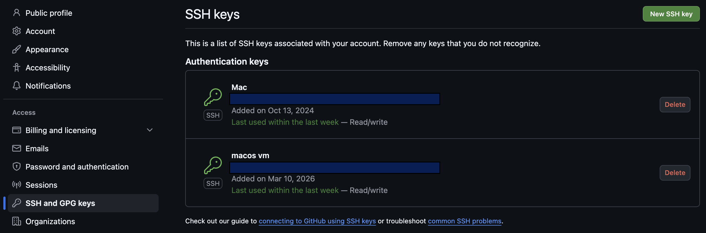
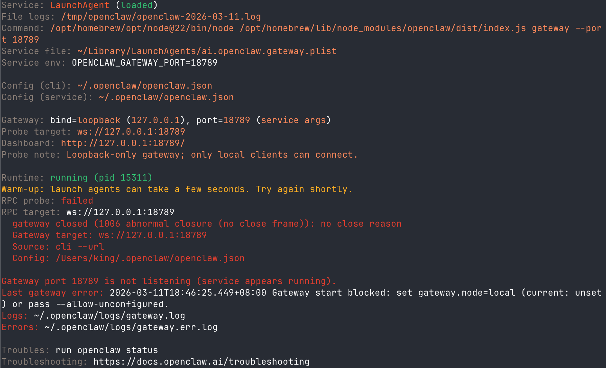

## 1. Introduction

OpenClaw is an open-source personal AI assistant that went viral in early 2026 (reaching over 150k stars on [GitHub](https://github.com/openclaw/openclaw) within two weeks). It can run on your own device and connect to mainstream messaging platforms such as WhatsApp, Telegram, Feishu and DingTalk, acting as a 7×24 all-in-one AI Agent.

This post provides a detailed guide on my experience deploying and using OpenClaw on a MacOS 14 virtual machine on UTM. The steps should be similar for other platforms, but I will focus on the MacOS setup.

## 2. Installation
The official doc [here](https://docs.openclaw.ai/start/getting-started) provides a straightforward installation guide, simply run a shell script and follow the prompts.

```shell
curl -fsSL https://openclaw.ai/install.sh | bash
```

However, there are still some details to note:

1. It is recommended to install [Homebrew](https://brew.sh/) first, as it will be used to install dependencies like Node.js and npm.
2. During the OpenClaw installation process using npm, I encountered error messages like the following:

```shell
[2/3] Installing OpenClaw
Installing OpenClaw v2026.3.8
npm install failed for openclaw@latest
Command: env SHARP_IGNORE_GLOBAL_LIBVIPS=1 npm --loglevel error -silent --no-fund --no-audit install -g openclaw@latest
Installer log: /var/folders/6_/tmf4y9z57qb4xznp0z2jzvjr0000gn/T/tmp.e20CuCZD9d
! npm install failed; showing last log lines
npm install failed; retrying npm install failed for openclaw@latest
_IGNORE_GLOBAL_LIBVIPS=1 npm --loglevel error --silent --no-fund --no-audit install -g openclaw@latest
Installer log: /var/folders/6_/tmf4y9z57qb4xznp0z2jzvjr0000gn/T/tmp.OHx9w3Puzu
npm install failed; showing last log
```

Then I tried to run `npm install -g openclaw@latest` directly in the terminal and found the error was related to `git`'s SSH cloning:

```shell
~ % npm install -g openclaw@latest
npm error code 128
npm error An unknown git error occurred
npm error command git --no-replace-objects ls-remote ssh://git@github.com/whiskeysockets/libsignal-node.git
npm error git@github.com: Permission denied (publickey).
npm error fatal: Could not read from remote repository.
```

To fix this, I set up SSH keys for GitHub and add the public key to my GitHub account. First, generate an SSH key pair if you don't have one:

```shell
# create this directory if it doesn't exist
cd ~/.ssh
ssh-keygen -t ed25519 -C "xxx@xxx.com" # replace xxx with your GitHub email
```

Then add the public key to your GitHub account by copying the contents of `~/.ssh/id_ed25519.pub` and adding it to the SSH keys section in your GitHub settings.



After that, try running the npm install command again, and it should work without errors, and ou can proceed with the OpenClaw shell script installation.

>My installed OpenClaw version is v2026.3.8.

## 3. Configurations

### 3.1 Gateway

After installation, it should automatically run `openclaw doctor` and start configuring the gateway where you can keep selecting the default options until it finishes, BUT an error occurred: gateway cannot start.



After some troubleshooting, I found that I need to configure first by running

```shell
openclaw configure
```

When asking "Where will the Gateway run?", select "Local (this machine)". Then it will let you select sections to configure, where you can select "Continue" first to skip all section *(Personally I found this configuration process a bit confusing)*.

To test if the gateway runs successfully, run the following command:

```shell
openclaw gateway restart
openclaw gateway status
```

There will not be any error message and the status should show "running" if the gateway is running successfully on the default port 18789.

### 3.2 Model Provider

After the gateway is running, you can start configuring. Run `openclaw onboard` and select "quickstart" mode and you will arrive at the **Model/auth provider** section. Here you can select the model provider you want to use, for example, I selected "Moonshot AI (Kimi K2.5)" and input the required information such as authorization method and API key.

### 3.3 Channels

After configuring the model provider, we arrive at the **Select channel** section, where you can choose your preferred messaging platform to connect with OpenClaw. I selected "Telegram" and followed the instructions to set up the Telegram bot and get the necessary credentials.

### 3.4 Skills

Then I came to the **Web search** part, where I selected Moonshot web search and input the required API key, and then the **Configure skills** section where you can select the skills you want to enable for your OpenClaw assistant, accompanied with the installation and configuration of the selected skills.

### 3.5 Hooks

Then comes the **Hooks** section, where you can set up custom hooks to trigger specific actions or workflows based on certain events or conditions. Currently there are 4 types of preset hooks:

```shell
🚀 boot-md - Run BOOT.md on gateway startup
📎 bootstrap-extra-files - Inject extra workspace bootstrap files during agent bootstrap
📝 command-logger - Log all command events to a centralized audit file
💾 session-memory - Save session context to memory when /new command is issued
```

you can enable or disable these hooks based on your needs.

### 3.6 Hatch

Finally, you will arrive at the **Hatch** section, where you can review your configurations and start your OpenClaw assistant. After confirming everything is set up correctly, you can hatch your assistant and it will be ready to use on your selected messaging platform. The more you tell it, the better the experience will be.

## 4. Use Cases

After successfully hatching the assistant, you can start interacting with it through your selected messaging platform. For example, if you chose Telegram, you can send messages to your OpenClaw bot and it will respond based on the configurations and skills you have set up. You can ask it to perform various tasks, such as answering questions, providing information, or even executing commands if you have enabled the relevant skills.


Beware that sometimes OpenClaw will ask for permissions to access certain resources or perform specific actions, so make sure to review and grant permissions carefully to ensure the security of your system.